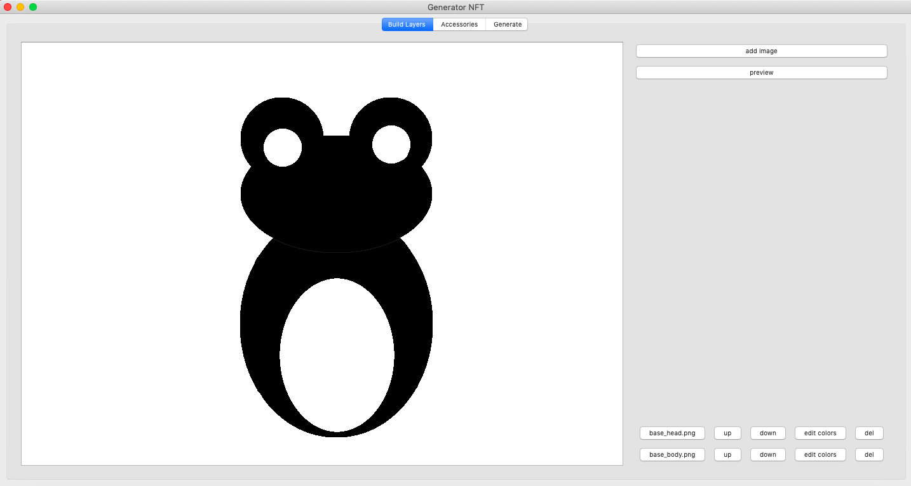
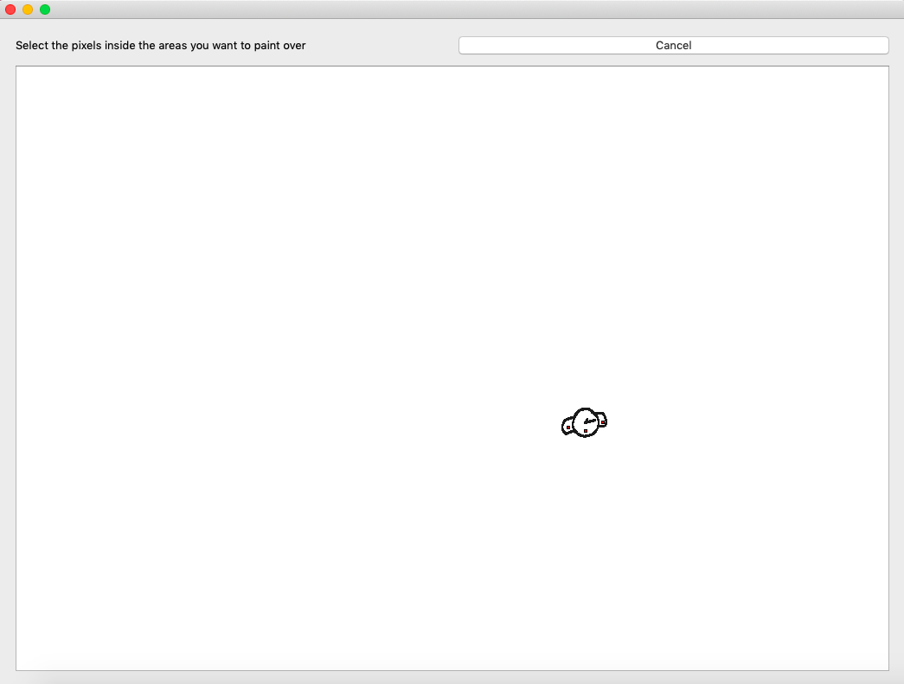
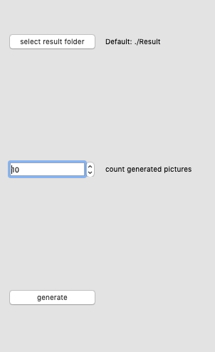

# NFT-generator

## About

An application that allows you to generate a collection of NFT images.
The application allows you to generate combinations of different colors of the layers of the main image, as well as to combine different types of "accessories".
In the layer settings, you can choose from the suggested list of colors that you want to use for generation.
To generate "accessories", you can select the areas that need to be painted over (by setting points inside these areas).
You can also choose the folder where you want to save the collection and the number of generated images.

## Run application

You can download the project files and run the program using

``python3 App.py``

But before starting, you need to install the necessary packages

``pip3 install -r requirements.txt``

## Examples

Example of editing layers

Example of choosing an anchors (red points at the picture)

Example of choosing a generate options

